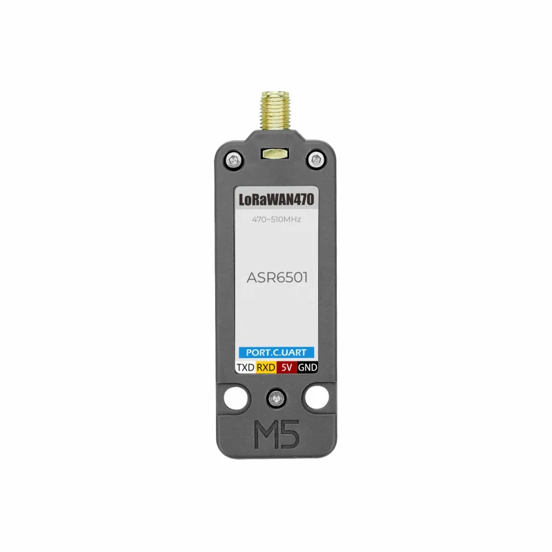
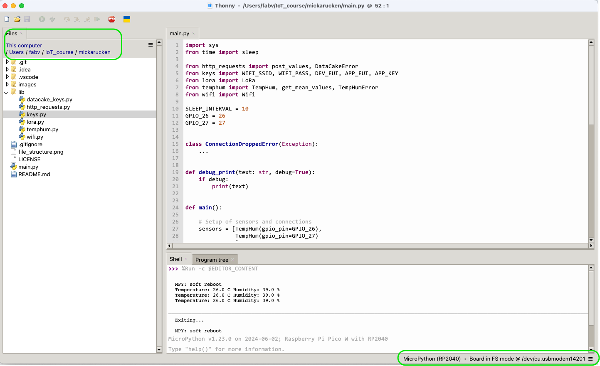
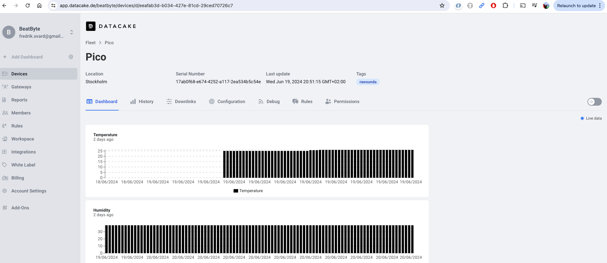

***Fredrik Svärd - fs223sq***

# Overview

The project introduces a solution how read humidity and temperature
using a a DHT11 sensors, Raspberry Pi Pico W and for foward it with help of WIFI or LoRA to 
visulalize it using DataCake. 

The project introduces a solution to read humidity and temperature using a DHT11 sensor, Raspberry Pi Pico W, and
forward the data with the help of Wi-Fi and/or LoRa, and later visualize the information using DataCake.”

This project was part of the course ***23ST-1DT305 Introduction to Applied IoT 2024*** at Linnaeus University,
Kalmar Sweden.

All information, images, and code shared in this report are under a MIT license.

This project can be completed in a few hours as long as you have all 
the prerequisite harddware and software setup.

# Objective

I choosen to build an application that could report humidity and temperature from garden community 
close to Brommaplan in Stockholm Sweden.

My plan was to use LoRa with either Helium or TTN as provider. It turn out that none of these providers
have coverage in this garden. My plan changed to use LoRa from my apartment since Helium have coverage
in this area.

The purpose with application was to monitor  temperature and humidity and se if the temperature
changes over time and and there is temperatures at the level of Frost, i.e. temperature goes under 0 C degrees 
during spring.

I think it will be possible to get some insight on how to use LoRa and perhaps lobby for installing
a LoRa gateway in the garden community.


# List of Materials

| Enity | price SEK including VAT|
| ----------- | ----------- |
| Solderless Breadboard 840 tie-points | 69  |
|USB cable A-male - microB-male| 39 | 
| Raspberry Pi Pico WH | 109  |
| 2 Digital temperature and humidity sensor DHT11 | 2* 49 *           |
| M5Stack LoRa module 868MHz | 330     |
| Jumper wires 40-pin 30cm male/male | 49           |
| Labbsladd Grove - 0.64mm hylsor 4-pol 200mm| 14.5 |

All equipment purchased from Electrokit


In this project I have chosen to work with the Pico RP2 w device as seen in Fig. 1

 
Fig 1.


It's  device programmed by MicroPython and has several bands of connectivity. 
The device has many digital and analog input and outputs and is well suited for an IoT project.

The DHT11 is a multipurpose device that could provide information about temperature and humudity.
It's mounted at a board that a includes a pull-up resistor to make the data signal stronger.
Fig 2.

 
Fig 2.


LoRaWAN UNIT 470MHz (ASR6501)

 


# Computer setup

How is the device programmed. Which IDE are you using. Describe all steps from flashing the firmware,
installing plugins in your favorite editor. How flashing is done on MicroPython. The aim is that a
beginner should be able to understand.
I have tried different type of Integrated Development Environment, IDE, like Pycharm, VScode and Thonny.
Thonny worked best when it comes to loading the target, i.e. Pico W, so I picked Thonny. The other
have better advantages when comes to supporting python.

When connecting the Pico the first time it shows up as a USB device if the push-button is actived.
To be able to load an application code the Pico W need firmware. This is easily achived by downloading
firmware from this site and that drag and drop it the the RP2 device. The firmware will be loaded
and when finished, rebooted by itself.

I use a MacOS as operating system

##Install Thonny

 

To upper left indicates the folder for the files for the project. All resides
on my computer.

Th lower right you can see that the Pico W is ocnnected. The IDE detects the
target when launched. Everything is a file in Linux, that is the case for the target in this
case. It's a devicefile cu.usbmodem14201.


## Flash Micropython to Raspberry Pico W


# Circuit diagram (can be hand drawn)
-Electrical calculations

 

Pins used:

 Functionality | physical pin | logical name |
| ----------- | ----------- |---|
| 3 Volt out | 36            | 3V3|
| Ground | 38               | GND|
| DHT 11 No1 | 32  | GPIO27|
| DHT 11 No2 | 31   |GPIO26|
| LoRa modem TX | 1               |UART0 TX |
| LoRa modem | 2               |UART0 RX  |


# Platform
Describe your choice of platform. If you have tried different platforms it can be good to provide a 
comparison.

Is your platform based on a local installation or a cloud? Do you plan to use a paid subscription or
a free? Describe the different alternatives on going forward if you want to scale your idea.

I choosen DataCake since it's easy and not to much work to get it going. With the measurement I 
have I think it's a good fit.


# The code

# Explain your code!
Transmitting the data / connectivity
How is the data transmitted to the internet or local server? Describe the package format. All the different steps that are needed in getting the data to your end-point. Explain both the code and choice of wireless protocols.

The file structure of the project it's simple. There is a ***main** function and number of files that
provides functionality to support the ***main** function.


| Functionality | File |
| ----------- | ----------- |
| Main program, endless loop | main.py |
| Read temperature and humidity | temphum.py |
| Post data to DataCake | http_requests.py |
| Connect to a WIFI network. source code copied, se below | wifi.py |
| Connect to a LoRa network. source code copied, se below | lora.py |
| Credentials for WIFI and DataCake | datacake_keys.py, keys |

Source code for WIFI and LoRa has been copied from https://github.com/iot-lnu/pico-w and refactored


file structure
````commandline=
.
├── LICENSE
├── README.md
├── lib
│   ├── datacake_keys.py
│   ├── http_requests.py
│   ├── keys.py
│   ├── lora.py
│   ├── temphum.py
│   └── wifi.py
└── main.py
````

The code have the following structure:
 - The are a setup phase, setting up WIFI, LoRA and sensors. 
 - Runtime phase where sensors are read  and posted to DataCake or some similar system. The intension is to have as much details to the the main function
as possible, **main** should deal more on behaviour.


```python

class TempHum:
    def __init__(self, gpio_pin: int) -> None:
        self.sensor = dht.DHT11(Pin(gpio_pin))

    # The DHT11 can be called no more than once per second and the DHT22 once every two
    # seconds for most accurate results. Sensor accuracy will degrade over time. Each sensor supports a different operating range. Refer to the product datasheets for specifics.

    def read_sensor(self) -> tuple[int, int]:
        try:
            self.sensor.measure()
            temp = self.sensor.temperature()
            hum = self.sensor.humidity()
        except Exception as err:
            raise TempHumError(f'Error, failed to read sensors! {err}')

        return temp, hum
```

```python
def get_mean_values(sensors: list) -> tuple[int, int]:
    def calculate_mean(arr: list):
        return sum(arr) / len(arr)

    valid_temps = []
    valid_hums = []

    for sensor in sensors:
        temp, hum = sensor.read_sensor()
        if 0 <= temp <= 50:
            valid_temps.append(temp)
        if 0 <= hum <= 100:
            valid_hums.append(hum)

    temp, hum = calculate_mean(valid_temps), calculate_mean(valid_hums)

    return temp, hum    

```

```python
def post_values(temp: int, hum: int) -> None:
    payload = {
        "serial": DATACAKE_SERIAL,
        "temperature": temp,
        "humidity": hum}
    json_payload = json.dumps(payload)

    response = urequests.post(DATACAKE_URL, data=json_payload)
    if response.status_code != HTTPStatus.OK:
        raise DataCakeError(f"Error, failed to post data! {response.status_code}")

```

```python
import sys
from time import sleep

from http_requests import post_values, DataCakeError
from keys import WIFI_SSID, WIFI_PASS, DEV_EUI, APP_EUI, APP_KEY
from lora import LoRa
from temphum import TempHum, get_mean_values
from wifi import Wifi

SLEEP_INTERVAL = 10
GPIO_27 = 27

def debug_print(text: str, debug=True):
    if debug:
        print(text)


def main():
    sensors = [TempHum(gpio_pin=GPIO_27),
               TempHum(gpio_pin=GPIO_27)
               ]
    wifi = Wifi(ssid=WIFI_SSID, password=WIFI_PASS)

    lora = LoRa()
    lora.setup_lora(dev_eui=DEV_EUI, app_eui=APP_EUI, app_key=APP_KEY)

    try:
        wifi.connect()
    except TimeoutError as err:
        print(f"{err}")

    while True:
        try:
            temp, hum = get_mean_values(sensors)
            debug_print(f"Temperature: {temp} C Humidity: {hum} %")
            if not wifi.connected():
                raise ConnectionDroppedError('Error, connection dropped')

            post_values(temp=temp, hum=hum)
            lora.send_over_lora(temp= temp, hum=hum )

            sleep(SLEEP_INTERVAL)

        except OSError as err:
            print(f"Problems with sensors? {err}")

        except ConnectionDroppedError as err:
            print(err)

        except DataCakeError as err:
            print(f"Failed to post{err}")

        except KeyboardInterrupt as err:
            print(f'Exiting...{err}')
            return 42


if __name__ == "__main__":
    sys.exit(main())

```


The rest of the source code is provided in in this repo. Please check these of reading of temperature and humidity is 
done and setup of Wifi and LoRa and code for forwarding data to the cloud.


# Finalizing the design
Show the final results of your project. Give your final thoughts on how you think the project went. What could have been done in an other way, or even better? Pictures are nice!


Show final results of the project
Pictures
*Video presentation
Last changed by
T

 

 


# Transmitting the data / connectivity


# Wifi track

# LoRa track

My primary was to have an application using LoRa, so that was my first attempt. I started to connect
the LoRa modem and and the provided example code from the common github repo provided på LNU. I tried
a number of combination and altered the code bit by bit. I moved the application and equipment to
the roof of our buildning. In the end of the setup of the modem there is a status check checking the
modem have connected to the network. Often I got halfway, saying: "There is data sent and success", code for this 
is "03" but the status expects "There is data sent and success, there is download too.". This did never happened.
I enabled loggning the modem, and suddenly it started to work....


Unit LoRaWAN868 is a LoRaWAN communication module suitable for 868MHz frequency launched by M5Stack. 
The module adopts the ASR6501 scheme, which supports long-distance communication and has both ultra-low power
consumption and high sensitivity. The module integrates the LoRaWAN protocol stack and adopts a serial communication
interface (using the AT command set for control). When used, it can be used as a collection node to access a large 
number of gateways for data collection and management. This module is suitable for long-distance low-power IoT
communication applications, such as deployment of environmental monitoring nodes.

 

```python=
def check_join_status(self):
        restr = ""
        self._write_cmd("AT+CSTATUS?\r\n")
        restr = self._get_response()
        if "+CSTATUS:" in restr and "08" in restr:
            return True

        return False
```
Note the credantinals are fake values
```commandline
>>> %Run -c $EDITOR_CONTENT

MPY: soft reboot
b'AT+CGMI?\r\n'b'\r\n'b'+CGMI=ASR\r\n'b'OK\r\n'
Module Connected
b'AT+CRESTORE\r\n'b'\r\n'b'OK\r\n'b'AT+ILOGLVL=1\r\n'b'\r\n'b'OK\r\n'b'AT+CSAVE\r\n'b'\r\n'b'OK\r\n'b'AT+IREBOOT=0\r\n'b'\r\n'b'OK\r\n'b'AT+CGMI?\r\n'b'\r\n'b'+CGMI=ASR\r\n'b'OK\r\n'
Module Config...
b'AT+CJOINMODE=0\r\n'b'\r\n'b'OK\r\n'
b'Ab'AT+CDEVEUI=F8C83B1925EEDD37\r\n'b'\r\n'b'OK\r\n'
b'AT+CAPPEUI=F8C83B1925EEDD37\r\n'b'\r\n'b'OK\r\n'
b'AT+CAPPKEY=42ED841CCD0A92561EA9ED33DF9CABBA\r\n'b'\r\n'b'OK\r\n'
b'AT+CULDLMODE=2\r\n'b'\r\n'b'OK\r\n'
b'AT+CCLASS=2\r\n'b'\r\n'b'OK\r\n'b'AT+CWORKMODE=2\r\n'b'\r\n'b'OK\r\n'b'AT+CDATARATE=5\r\n'b'\r\n'b'+CME ERROR:1\r\n'
Start Join.....
b'AT+CRXP=0,0,869525000\r\n'b'\r\n'b'OK\r\n'b'AT+CFREQBANDMASK=0001\r\n'b'\r\n'b'OK\r\n'b'AT+CJOIN=1,0,10,8\r\n'b'\r\n'b'OK\r\n'b'AT+CSTATUS?\r\n'b'\r\n'b'+CSTATUS:03\r\n'b'OK\r\n'
Joining....
b'AT+CSTATUS?\r\n'b'\r\n'b'+CSTATUS:03\r\n'b'OK\r\n'
Joining....
b'AT+CSTATUS?\r\n'b'\r\n'b'+CSTATUS:03\r\n'b'OK\r\n'
Joining....
b'AT+CSTATUS?\r\n'b'\r\n'b'+CSTATUS:03\r\n'b'OK\r\n'
Joining....
```

Climbed to the roof and enabled logging by the modem


```commandline
MPY: soft reboot
.
..
...
Start Join.....
b'AT+CRXP=0,0,869525000\r\n'b'\r\n'b'OK\r\n'b'AT+CFREQBANDMASK=0001\r\n'b'\r\n'b'OK\r\n'b'AT+CJOIN=1,0,10,8\r\n'b'\r\n'b'OK\r\n'b'AT+CSTATUS?\r\n'b'\r\n'b'+CSTATUS:03\r\n'b'OK\r\n'
Join success!
SENT AT+DTRX=1,1,8,ff7201a9

b'AT+DTRX=1,1,8,ff7201a9\r\n'b'\r\n'b'ERR+SEND:00\r\n'
Sent message: ff7201a9
```

 


 


https://hackmd.io/@lnu-iot/iot-tutorial#How-to-write-your-tutorial
