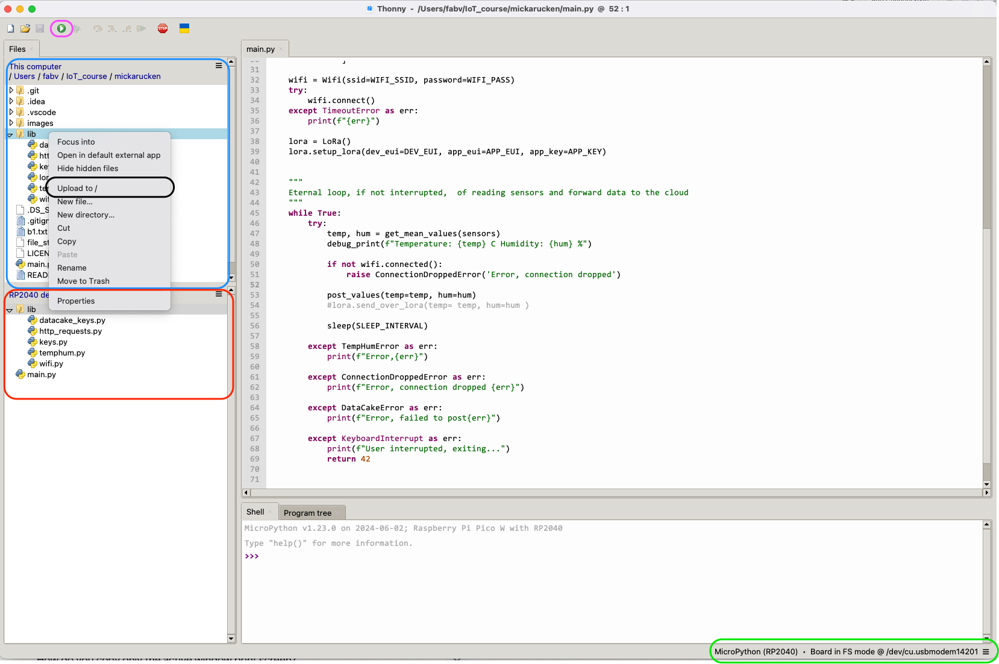
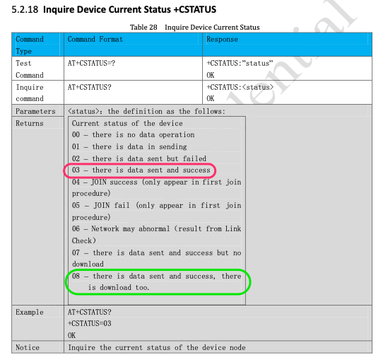

 ***Fredrik Svärd - fs223sq*** 

# Overview

The project introduces a solution to read humidity and temperature using a DHT11 sensors, Raspberry Pi Pico W, and
forward the data with the help of Wi-Fi and/or LoRa, and later visualize the information using DataCake.

This project was part of the course ***23ST-1DT305 Introduction to Applied IoT 2024*** at Linnaeus University,
Kalmar Sweden.

All information, images, and code shared in this report are under a MIT license.

This project can be completed in a few hours as long as you have all 
the prerequisite harddware and software setup.

# Objective

I choosen to build an application that could report humidity and temperature from garden community 
close to Brommaplan in Stockholm Sweden.

My plan was to use LoRa with either Helium or TTN as provider. It turns out that none of these providers
have coverage in this area. My plan changed to either use LoRa from my apartment since Helium have coverage
in this area and if that doesnt work go for WIFI

The purpose with application was to monitor  temperature and humidity and see if the temperature
changes over time and and there is temperatures at the level of Frost.This typically happens during
the night when the air temperature drops and moisture in the air condenses and 
freezes on surfaces like grass, car windows, and roofs.

# List of Materials

| Unit | price SEK including VAT|
| ----------- | ----------- |
| Solderless Breadboard 840 tie-points | 69  |
|USB cable A-male - microB-male| 39 | 
| Raspberry Pi Pico WH | 109  |
| 3 Digital temperature and humidity sensor DHT11 | 3 * 49   |
| 4.7 kohm resistor | 1  |
| M5Stack LoRa module ASR6501 868MHz including antenna | 330  |
| Jumper wires 40-pin 30cm male/male | 49   |
| Lab cord Grove - 0.64mm sockets 4-pol 200mm| 14.5 |

All equipment purchased from Electrokit.


In this project I have chosen to work with the Pico RP2 w device as seen in Fig. 1.
It's  device can be programmed with MicroPython and has several bands of connectivity. 
The device has many digital and analog input and outputs and is well suited for an IoT project.


Fig 1.

The DHT11 is a multipurpose device that could provide information about temperature and humudity.
It's mounted at a board that a includes a pull-up resistor. I have used 3 DHT11s. Two with boards
one without. The one without needed a external resistor 4.7 kohm.

I noticed early that the accuracy of the DHT11 was not than good, so I decided to  do budget Triple Modular Redundancy (TMR).
Out of three always pick 2 ones closest to each other in temperature and humidity.

Figure 2 shows the one mounted on a board including a resistor.


Fig 2.


LoRaWAN868/ASR6501 Unit is a LoRaWAN communication module designed for the 868MHz frequency range. 
It supports the LoRaWAN protocol. The module utilizes a serial communication interface and 
can be controlled using the AT command set. Fig 3.


Fig 3


# Computer setup

My host operation system is MacOs/Unix.

I have tried different type of Integrated Development Environments, IDEs, like Pycharm, VScode and Thonny.
Thonny worked best when it comes to loading and commence exuction on the target, i.e. Pico W, so I picked Thonny. The other
two have better supports when comes to programming python, but since project i small it works well with Thonny.

#### Flash Micropython to Raspberry Pico W

When connecting the Pico the first time it shows up as a USB device if the push-button (BOOTSEL) is actived during boot.
To be able to load an application code the Pico W needs firmware. This is easily achived by downloading
firmware from this site [micropython pico w](https://micropython.org/download/RPI_PICO_W/ )and that drag and drop to dowloaded
fil to the the RP2 device. The firmware will be loaded  and when finished, rebooted by itself.

#### Overview, Thonny

First view of the Thony IDE. Marked in a blue rectangle, the root folder of the project
and the source code. Marked in red rectangle the files on the target, i.e. the Pico W. Marked in green rectangle
shows that the IDE have contact with the target. As seen it shows up as a device file. (everything is
a file in unix :-)). Marked in black rectangle, a feature that makes it possible to upload folder/files from your computer 
to the target.




When trying to open a folder the IDE prompts with a choice to either open files on your computer
or on the target.


When chosen RP2040 device there a new window to select files to execute. In this case
select main.py and push **OK** button


Next step is to commence execution by pushing the green button, marked in red.


# Circuit diagram (can be hand drawn)
-Electrical calculations

 

Pins used:

 Functionality | physical pin | logical name |
| ----------- | ----------- |---|
| 3 Volt out | 36            | 3V3(OUT) |
| Ground | 38               | GND|
| DHT 11 No1 | 32  | GPIO27|
| DHT 11 No2 | 31   |GPIO26|
| DHT 11 No3 | 29   |GPIO22|
| LoRa modem TX | 1   |UART0 TX |
| LoRa modem | 2  |UART0 RX  |

All devices are connected to the power supply provided by Pico W.

One of the DHT11 do not have a board, so there was a need of a externnal resistor
4.7 kohm as pull resistor to power supply, see figure 4


fig 4.


 


# Platform

I choosen DataCake since it's easy and not to much work to get it going. With the measurement I 
have I think it's a good fit. Apart from setting up the acount on DataCake need to configure
how the data that arrives should be decoded, see below and how it should be presented in   Dashboard.

DataCake is free for small amount of data.

DataCake generates a serial number that the application program in target should use so DataCake
will be able to identify from where the data is coming.


Decoder code in DataLake, written i javscript ....

```javascript=
function Decoder(request) {
  
    // First, parse the request body into a JSON object to process it
    var payload = JSON.parse(request.body)
    
    var serialNumber = payload.serial


    /*
    Sample return format:
    If you wish to manually return a fixed structure, Datacake API devices require the following format:
    */
    return [
        {
            device: serialNumber, 
            field: "TEMPERATURE",
            value: payload.temperature
        },
        {
            device: serialNumber,
            field: "HUMIDITY",
            value: payload.humidity
        }
    ];
    
}
```


# The code


The file structure of the project it's simple. There is a **main()**-function and number of files that
provides functionality to support the **main** function.


| Functionality | File |
| ----------- | ----------- |
| Main program, endless loop | main.py |
| Read temperature and humidity | temphum.py |
| Post data to DataCake | http_requests.py |
| Connect to a WIFI network | wifi.py |
| Connect to a LoRa network | lora.py |
| Credentials for WIFI and DataCake | datacake_keys.py, keys |

Source code for WIFI and LoRa has been copied from [^1]  [github.com/iot-lnu/pico-w](https://github.com/iot-lnu/pico-w).
I am truly thankful for this support! Part of the that source code is rewritten to suit my means.

The project have the following file structure:

````commandline=
.
├── LICENSE
├── README.md
├── lib
│   ├── datacake_keys.py
│   ├── http_requests.py
│   ├── keys.py
│   ├── lora.py
│   ├── temphum.py
│   └── wifi.py
└── main.py
````

Support functions reside under the lib-folder. This i also a folder that the micropython interpreter will look at
to find files for import. The main file resides under the project root.


#### Reading temperature and humidity

The core functionality for reading temperature and humidity is implemented in  a class **TempHum**. The
implementation makes it possible create several objects but different logical pin anmes. Nota Bene: The DHT11 can be called no more than once per second.
In case of reading error a exception will be raised. The caller needs to take care of the exception.

```python

class TempHum:
    def __init__(self, gpio_pin: int) -> None:
        self.sensor = dht.DHT11(Pin(gpio_pin))

    def read_sensor(self) -> tuple[int, int]:
        try:
            self.sensor.measure()
            temp = self.sensor.temperature()
            hum = self.sensor.humidity()
        except Exception as err:
            raise TempHumError(f'Error, failed to read sensors! {err}')

        # The DHT11 can be called no more than once per second.
        # Avoid any complications delay it here.
        time.sleep(1)

        return temp, hum
```

#### Calculating mean value

The function **get_mean_values()** calculates mean values and can handle a list of
sensor objects. Values outside a range will be discarded. This application uses
3 DHT11 and select two of them, i.e. the ones closest in measurement and than
build a mean value for temperature and humidity.

```python
def get_mean_values(sensors: list[dht.DHT11]) -> tuple[float, float]:

    def closest_pair(values: list) -> tuple:
        # Calculate the absolute differences between each pair
        ab_diff = abs(values[0] - values[1])
        ac_diff = abs(values[0] - values[2])
        bc_diff = abs(values[1] - values[2])

        # Determine the pair with the smallest difference
        if ab_diff <= ac_diff and ab_diff <= bc_diff:
            return values[0], values[1]
        if ac_diff <= ab_diff and ac_diff <= bc_diff:
            return values[0], values[2]

        return values[1], values[2]

    def calculate_mean(arr: tuple) -> float:
        return sum(arr) / len(arr)

    temps = []
    hums = []

    for sensor in sensors:
        temp, hum = sensor.read_sensor()
        if 0 <= temp <= 50:
            temps.append(temp)
        if 0 <= hum <= 100:
            hums.append(hum)

    valid_temps = closest_pair(temps)
    valid_hums = closest_pair(hums)

    temp, hum = calculate_mean(valid_temps), calculate_mean(valid_hums)

    return temp, hum
   

```


#### Post values

Post values from sensors to DataCake. An exception will be raised in case of failure, e.g. bad reply from DataCake
other errors.

```python
def post_values(temp: int, hum: int) -> None:
    payload = {
        "serial": DATACAKE_SERIAL,
        "temperature": temp,
        "humidity": hum}
    json_payload = json.dumps(payload)

    try:
        response = urequests.post(DATACAKE_URL, data=json_payload)
    except OSError as err:
        raise DataCakeError(f"Error, failed to post DataCake: {err}")

    if response.status_code != HTTP_STATUS_OK:
        raise DataCakeError(f"Error, failed to post data! {response.status_code}")
```

I have observed that sometimes there is a problem with posting due memory problem (ENOMEM). I that
momement I don't know the root cause of this problem.

```commandline
Temperature: 25.5 C Humidity: 32.5 %
Temperature: 25.5 C Humidity: 32.5 %
Error, failed to postError, failed to post DataCake:[Errno 12] ENOMEM
Temperature: 25.5 C Humidity: 32.5 %
Error, failed to postError, failed to post DataCake:[Errno 12] ENOMEM
Temperature: 25.5 C Humidity: 32.5 %

```

### main 

The **main()** function calls the provided TempHum-objects, calculate mean values and post it to DataCake.
This will go on forever in an eternal loop. **main()** function catch exceptions and raise exception too. 
Only a user intervention terminates the program. A periodic timer toggles the builtin LED if the Wifi connection
is alive.

The program can be divided int two parts:

 - Setup phase, setting up WIFI, LoRA and sensors. 

 - Eternal loop phase where sensors are read and posted to DataCake or some similar systems. 
   The intention is to have as little knowledge of the underlaying functionality, promote readability
   and if needed dig deeper, like how Wifi is set up or sensors are read.
   
```python
def main():
    sensors = [TempHum(gpio_pin=26),
               TempHum(gpio_pin=27),
               TempHum(gpio_pin=22)
               ]

    wifi = Wifi(ssid=WIFI_SSID, password=WIFI_PASS)
    try:
        wifi.connect()
    except WifiTimeout as err:
        print(f"Error {err}")

    monitor_wifi = MonitorWifi(wifi=wifi)
    Timer(period=5000, mode=Timer.PERIODIC, callback=lambda t: monitor_wifi())

    lora = LoRa()
    try:
        lora.setup_lora(dev_eui=DEV_EUI, app_eui=APP_EUI, app_key=APP_KEY)
    except LoRaTimeout as err:
        print(f"Error, timeout on LoRa: {err}")

    while True:
        try:
            temp, hum = get_mean_values(sensors)
            debug_print(f"Temperature: {temp} C Humidity: {hum} %")

            post_values(temp=temp, hum=hum)

            lora.send_over_lora(temp=temp, hum=hum)

    
        except TempHumError as err:
            print(f"Error, {err}")

        except ConnectionDroppedError as err:
            print(f"Error, connection dropped {err}")

        except DataCakeError as err:
            print(f"Error, failed to post{err}")

        except KeyboardInterrupt as err:
            print(f"User interrupted, exiting...")
            return 42

        sleep(SLEEP_INTERVAL)

if __name__ == "__main__":
    sys.exit(main())


```
The rest of the source code is provided in this repo. Please check setup of Wifi and LoRa.
The code for Wifi and LoRa as been copied from [github.com/iot-lnu/pico-w](https://github.com/iot-lnu/pico-w). many thanks!

# Finalizing the design

Show the final results of your project. Give your final thoughts on how you think the project went. What could 
have been done in an other way, or even better? Pictures are nice!


 


# Transmitting the data / connectivity

My primary goal was to have an application using LoRa, so that was my first attempt. I started to connect
the LoRa module and and the provided example code from the common github repo provided på LNU. I tried
a number of combination and altered the code bit by bit. I moved the application and equipment to
the roof of our buildning. 

The python code for LoRA sends a number of **AT-commands** to the module. At a point it starts to
initiate a join() to the network and than use the **AT-command CSTATUS** 

 


In the end of the setup of the modem there is a status check checking the
modem have connected to the network. Often I got halfway, saying: **There is data sent and success**, status code for this 
is **03** but the status,check_join_status() se below,  expects **There is data sent and success, there is download too.**
equal to status code **08**
This did never happened. I enabled loggning the modem, and suddenly it started to work....


 

```python=
   def _check_join_status(self):
        restr = ""
        self._write_cmd("AT+CSTATUS?\r\n")
        restr = self._get_response()
        if "+CSTATUS:" in restr and "08" in restr:
            return True

        return False
```
Note the credentials are fake values
```commandline
>>> %Run -c $EDITOR_CONTENT

MPY: soft reboot
b'AT+CGMI?\r\n'b'\r\n'b'+CGMI=ASR\r\n'b'OK\r\n'
Module Connected
b'AT+CRESTORE\r\n'b'\r\n'b'OK\r\n'b'AT+ILOGLVL=1\r\n'b'\r\n'b'OK\r\n'b'AT+CSAVE\r\n'b'\r\n'b'OK\r\n'b'AT+IREBOOT=0\r\n'b'\r\n'b'OK\r\n'b'AT+CGMI?\r\n'b'\r\n'b'+CGMI=ASR\r\n'b'OK\r\n'
Module Config...
b'AT+CJOINMODE=0\r\n'b'\r\n'b'OK\r\n'
b'Ab'AT+CDEVEUI=F8C83B1925EEDD37\r\n'b'\r\n'b'OK\r\n'
b'AT+CAPPEUI=F8C83B1925EEDD37\r\n'b'\r\n'b'OK\r\n'
b'AT+CAPPKEY=42ED841CCD0A92561EA9ED33DF9CABBA\r\n'b'\r\n'b'OK\r\n'
b'AT+CULDLMODE=2\r\n'b'\r\n'b'OK\r\n'
b'AT+CCLASS=2\r\n'b'\r\n'b'OK\r\n'b'AT+CWORKMODE=2\r\n'b'\r\n'b'OK\r\n'b'AT+CDATARATE=5\r\n'b'\r\n'b'+CME ERROR:1\r\n'
Start Join.....
b'AT+CRXP=0,0,869525000\r\n'b'\r\n'b'OK\r\n'b'AT+CFREQBANDMASK=0001\r\n'b'\r\n'b'OK\r\n'b'AT+CJOIN=1,0,10,8\r\n'b'\r\n'b'OK\r\n'b'AT+CSTATUS?\r\n'b'\r\n'b'+CSTATUS:03\r\n'b'OK\r\n'
Joining....
b'AT+CSTATUS?\r\n'b'\r\n'b'+CSTATUS:03\r\n'b'OK\r\n'
Joining....
b'AT+CSTATUS?\r\n'b'\r\n'b'+CSTATUS:03\r\n'b'OK\r\n'
Joining....
b'AT+CSTATUS?\r\n'b'\r\n'b'+CSTATUS:03\r\n'b'OK\r\n'
Joining....
```

Climbed to the roof and enabled logging by the modem


```commandline
MPY: soft reboot
.
..
...
Start Join.....
b'AT+CRXP=0,0,869525000\r\n'b'\r\n'b'OK\r\n'b'AT+CFREQBANDMASK=0001\r\n'b'\r\n'b'OK\r\n'b'AT+CJOIN=1,0,10,8\r\n'b'\r\n'b'OK\r\n'b'AT+CSTATUS?\r\n'b'\r\n'b'+CSTATUS:03\r\n'b'OK\r\n'
Join success!
SENT AT+DTRX=1,1,8,ff7201a9

b'AT+DTRX=1,1,8,ff7201a9\r\n'b'\r\n'b'ERR+SEND:00\r\n'
Sent message: ff7201a9
```


[^1]: [github.com/iot-lnu/pico-w](https://github.com/iot-lnu/pico-w).


https://hackmd.io/@lnu-iot/iot-tutorial#How-to-write-your-tutorial


# Definitions

LoRa - Long Range ....

Helium -

TTN

WiFi


