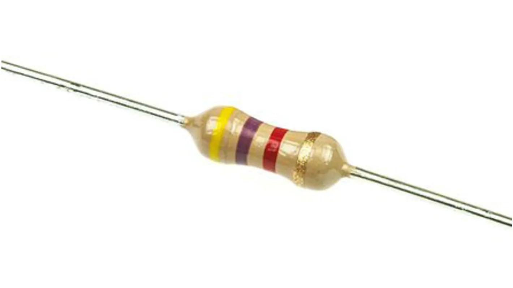
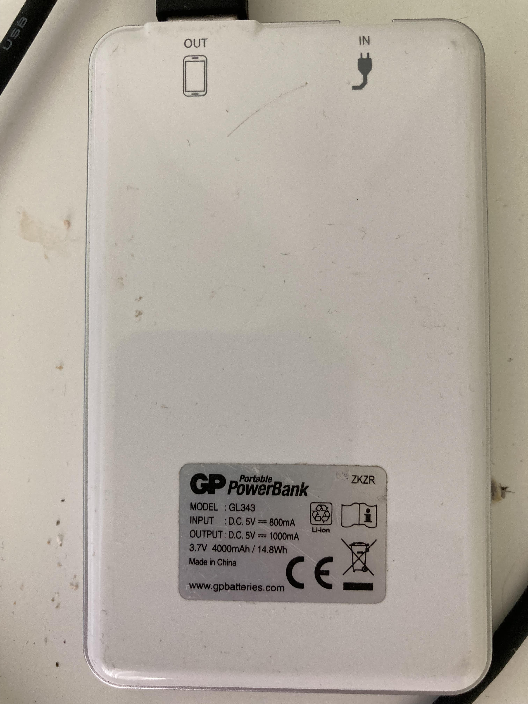
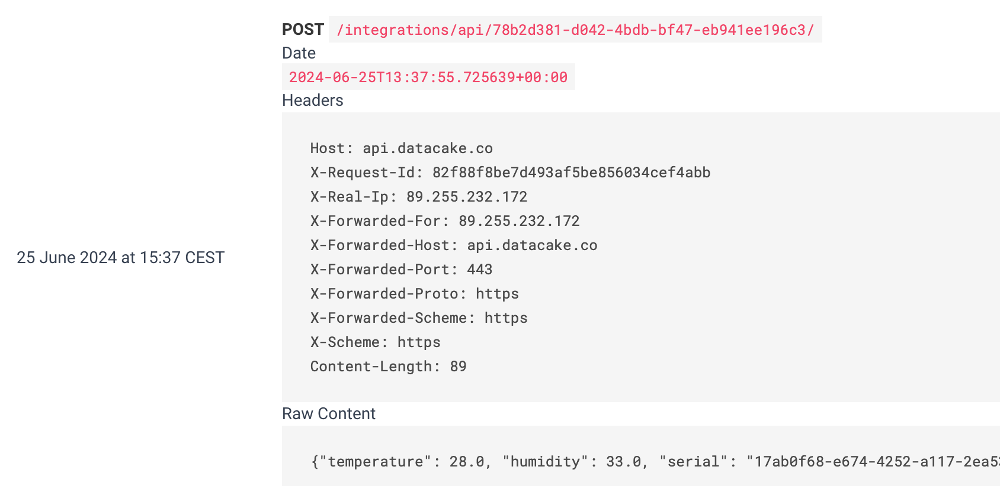
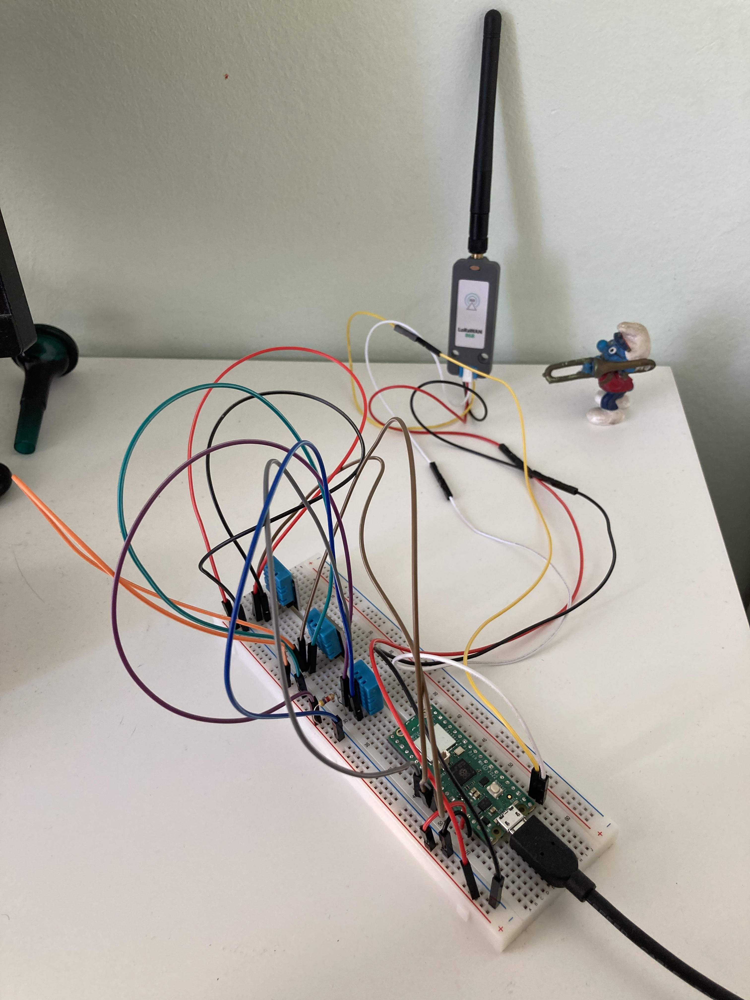

 ***Fredrik Svärd - fs223sq*** 

# Tutorial on how to build an IoT application for temperature and humidity sensors

The project introduces a solution to read humidity and temperature using  DHT11 sensors, Raspberry Pi Pico W, and
forward the data with the help of Wi-Fi and/or LoRa, and later visualize the information using DataCake.

This project was part of the course ***23ST-1DT305 Introduction to Applied IoT 2024*** at Linnaeus University,
Kalmar Sweden.

All information, images, and code shared in this report are under  [MIT license](https://mit-license.org/).

This project can be completed in a few hours as long as you have all 
the prerequisite hardware and software setup.

# Objective

I have chosen to build an application that could report humidity and temperature from an allotment garden 
close to Brommaplan in Stockholm Sweden.

My plan was to use LoRa with either Helium or TTN (networks of IoT) as provider. It turns out that none of these providers
have coverage in this area.

The purpose with the application was to monitor  temperature and humidity and see if the temperature
changes over time and there is temperatures at the level of [Frost](https://en.wikipedia.org/wiki/Frost).This typically happens during
the night when the air temperature drops and moisture in the air condenses and 
freezes on surfaces like grass, car windows, and roofs.

I hope that this give me knowledge about temperature and humidity conditions at an allotment garden and IoT technology.

# List of Materials

| Unit                                                          | price SEK including VAT |
|---------------------------------------------------------------|-------------------------|
| Solderless Breadboard 840 tie-points                          | 69                      |
| USB cable A-male - microB-male                                | 39                      | 
| Raspberry Pi Pico WH                                          | 109                     |
| 2 Digital temperature and humidity sensor DHT11 with board    | 2 * 49                  |
| 1 Digital temperature and humidity sensor DHT11 without board | 49                      |
| 4.7 kohm resistor                                             | 1                       |
| M5Stack LoRa module ASR6501 868MHz including antenna          | 330                     |
| Jumper wires 40-pin 30cm male/male                            | 49                      |
| Lab cord Grove - 0.64mm sockets 4-pol 200mm                   | 14.5                    |
| GP Powerbank GL343, 3.7V 4000 mAh                              | 241                     |
| ∑                                                             | 999.5                   |

All equipment purchased from Electrokit.


In this project I have chosen to work with the Pico RP2 w device as seen in Fig. 1.
This device can be programmed with MicroPython and has several bands of connectivity. 
The device has many digital and analog input and outputs and is well suited for an IoT project.


Fig 1.

The DHT11 is a multipurpose device that can provide information about temperature and humidity.
It's mounted at a board that a includes a pull-up resistor. I have used 3 DHT11s. 2 with boards and
1 without. The one without needed a external resistor, 4.7 kohm.

I noticed early that the accuracy of the DHT11 was not than good, so I decided to do a simple triple modular redundancy solution.
Out of three always pick 2 ones closest to each other in temperature and humidity.


Figure 2a shows the one mounted on a board including a resistor.


Figure 2b shows the DHT11 without board.

4.7 kohm resistor, Fig 3



Fig 3.


LoRaWAN868/ASR6501 Unit is a LoRaWAN communication module designed for the 868MHz frequency range (Europe). 
It supports the LoRaWAN protocol. The module utilizes a serial communication interface and 
can be controlled using the AT command set. 
Fig 4.


Fig 4.

GP Powerbank GL343, 4000 mAh, Fig 5.



Fig 5.


# Computer setup

My host operation system is MacOs/Unix.

I have tried different type of Integrated Development Environments, IDEs, like Pycharm, VScode and Thonny.
Thonny worked best when it comes to detect, load files and commence execution on the target, i.e. Pico W, so I picked [Thonny](https://thonny.org/). The other
two have better support when comes to programming python, but since project is small it works well with Thonny.

#### Flash Micropython to Raspberry Pico W

First, push the BOOTSEL button on the pico w and **then** connect the USB cable.  The Pico shows up as a USB device on your computer.
To be able to load application code the Pico needs firmware. This is easily achieved by downloading
firmware from this site [micropython pico w](https://micropython.org/download/RPI_PICO_W/ ) and then drag and drop to the dowloaded
file to the  RP2 device. The firmware will be loaded and when finished, rebooted by itself.

#### Chosen IDE, Thonny

First view of the Thony IDE. Marked in a blue rectangle, the root folder of the project
and the source code. Marked in red rectangle the files on the target, i.e. the Pico W. Marked in green rectangle
shows that the IDE have contact with the target. As seen it shows up as a device file. (everything is
a file in unix :-)). Marked in black rectangle, a feature that makes it possible to upload folder/files from your computer 
to the target.


When trying to open a folder the IDE prompts with a choice to either open files on your computer
or on the target.


When chosen RP2040 device there a new window to select files to execute. In this case
select main.py and push **OK** button


# Circuit diagram


 


Pins used:

 Functionality | physical pin | logical name |
| ----------- | ----------- |---|
| 3 Volt out | 36            | 3V3(OUT) |
| Ground | 38               | GND|
| DHT 11 No1 | 32  | GPIO27|
| DHT 11 No2 | 31   |GPIO26|
| DHT 11 No3 | 29   |GPIO22|
| LoRa modem TX | 1   |UART0 TX |
| LoRa modem | 2  |UART0 RX  |

USB connector:

GP Powerbank GP343 4000 mAh.


All devices are connected to the power supply indirectly provided by Pico W. This means that the Ground (pin38)
and VCC (3V) will be connected to  columns minus (-) and plus (+) on the breadboard and all devices connects
to these columns.

One of the DHT11 do not have a board, so there was a need of a external resistor
4.7 kohm as pull resistor to power supply, see figure 4


Fig 4.

The LoRa module requires 3V as Vcc Figure 5. 


Fig 5.

This setup only to be used for development.

# Power consumption

 Devices | consumption, mA |
|--------|-----------------|
| Pico wRP2 | 45              | 
| 3 DHT11 | 3 * 0.3         | 
| LoRa module | 5               | 
| ∑      | 51              |

Powerbank 4000 mAh, gives 4000/51 -> 78 hours -> approximately 3 days.


# Platform

I have chosen a cloud solution i.e. DataCake since it's easy and not to much work to get it going. With the measurement I think 
it's a good fit. Apart from setting up the acount on DataCake we need to configure
how the data that arrives should be decoded, see below and how it should be presented in a Dashboard.

DataCake is free for small amount of data.

At configuration of DataCake, a serial number will be generated
 that the application program in target should use so DataCake
will be able to identify the source of the data .

# The code


The file structure of the project it's simple. There is a **main()**-function and number of files that
provides functionality to support the **main** function.


| Functionality                                                            | File |
|--------------------------------------------------------------------------| ----------- |
| Main program, setup and endless loop                                     | main.py |
| Read temperature and humidity. Pick 'best' values. Calculate mean values | temphum.py |
| Post data to DataCake                                                    | http_requests.py |
| Connect to a WIFI network                                                | wifi.py |
| Connect to a LoRa network                                                | lora.py |
| Credentials for WIFI and DataCake                                        | datacake_keys.py, keys |

Source code for WiFi and LoRa has been copied from [^1]  [github.com/iot-lnu/pico-w](https://github.com/iot-lnu/pico-w).
I am truly thankful for the example code given! Part of the that source code is rewritten to suit my means.

The project have the following file structure:

````commandline=
.
├── LICENSE
├── README.md
├── lib
│   ├── datacake_keys.py
│   ├── http_requests.py
│   ├── keys.py
│   ├── lora.py
│   ├── temphum.py
│   └── wifi.py
└── main.py
````

Support functions reside under the lib-folder. This is also a folder that the micropython interpreter will look at
to find files to import. The main file resides under the project root.


#### Reading temperature and humidity

The core functionality for reading temperature and humidity is implemented in  a class **TempHum**. The
implementation makes it possible create several objects but different logical pin names as parameter to the constructor. **Nota Bene:** The DHT11 can be called no more than once per second.
In case of reading error an exception will be raised. The caller needs to take care of the exception.

```python

class TempHum:
    def __init__(self, gpio_pin: int) -> None:
        self.sensor = dht.DHT11(Pin(gpio_pin))

    def read_sensor(self) -> tuple[int, int]:
        try:
            self.sensor.measure()
            temp = self.sensor.temperature()
            hum = self.sensor.humidity()
        except Exception as err:
            raise TempHumError(f'Error, failed to read sensors! {err}')

        # The DHT11 can be called no more than once per second.
        # Avoid any complications delay it here.
        time.sleep(1)

        return temp, hum
```

#### Calculating mean value

The function **get_mean_values()** calculates mean values and can handle a list of integers. 
Values outside a range will be discarded. This application uses
3 DHT11 and select two of them, i.e. the ones closest in measurement and than
build a mean value for temperature and humidity.

Function in the scope of **get_mean_values()**.

**closest_pair** Calculates the pair closest and return that pair.

**calculate_mean** Calculate mean.

```python
def get_mean_values(sensors: list[int]) -> tuple[float, float]:
    def closest_pair(values: list) -> tuple:
        a, b, c = values[0], values[1], values[2]
        # Calculate the absolute differences between each pair
        ab_diff = abs(a - b)
        ac_diff = abs(a - c)
        bc_diff = abs(b - c)

        # Determine the pair with the smallest difference
        if ab_diff <= ac_diff and ab_diff <= bc_diff:
            return a, b
        if ac_diff <= ab_diff and ac_diff <= bc_diff:
            return a, c

        return b, c

    def calculate_mean(arr: tuple) -> float:
        return sum(arr) / len(arr)

    temps = []
    hums = []

    for sensor in sensors:
        temp, hum = sensor.read_sensor()
        if 0 <= temp <= 50:
            temps.append(temp)
        if 0 <= hum <= 100:
            hums.append(hum)

    valid_temps = closest_pair(temps)
    valid_hums = closest_pair(hums)

    temp, hum = calculate_mean(valid_temps), calculate_mean(valid_hums)

    return temp, hum
```


### main 

The **main()** function calls the provided TempHum-objects, calculate mean values and post it to DataCake.
This will go on forever in an eternal loop. **main()** function catch exceptions and raise exception too. 
Only a user intervention terminates the program. A periodic timer toggles the builtin LED if the Wifi connection
is alive.

The program can be divided int two parts:

 - Setup phase, setting up WiFi, LoRA and sensors. 

 - Eternal loop phase where sensors are read and posted to DataCake or some similar systems. The intention
   is that **main()** have less knowledge of details, this promotes readability and makes it easy to move
   from a LoRa solution to a Wifi and vice versa.

 - **main()** will continue if LoRa setup fails/timeouts and only use WiFi solution. The send_over_lora() method will return immediately when called.
   
```python
def main():
    sensors = [TempHum(gpio_pin=26),
               TempHum(gpio_pin=27),
               TempHum(gpio_pin=22)
               ]

    wifi = Wifi(ssid=WIFI_SSID, password=WIFI_PASS)
    try:
        wifi.connect()
    except WifiTimeout as err:
        print(f"Error {err}")

    monitor_wifi = MonitorWifi(wifi=wifi)
    Timer(period=5000, mode=Timer.PERIODIC, callback=lambda t: monitor_wifi())

    lora = LoRa()
    try:
        lora.setup_lora(dev_eui=DEV_EUI, app_eui=APP_EUI, app_key=APP_KEY)
    except LoRaTimeout as err:
        print(f"Error, timeout on LoRa: {err}")

    while True:
        try:
            temp, hum = get_mean_values(sensors)
            debug_print(f"Temperature: {temp} C Humidity: {hum} %")

            post_values(temp=temp, hum=hum)

            lora.send_over_lora(temp=temp, hum=hum)

    
        except TempHumError as err:
            print(f"Error, {err}")

        except ConnectionDroppedError as err:
            print(f"Error, connection dropped {err}")

        except DataCakeError as err:
            print(f"Error, failed to post{err}")

        except KeyboardInterrupt as err:
            print(f"User interrupted, exiting...")
            return 42

        sleep(SLEEP_INTERVAL)

if __name__ == "__main__":
    sys.exit(main())


```
The rest of the source code is provided in this repo. Please check setup of Wifi and LoRa.
The code for Wifi and LoRa as been copied from [github.com/iot-lnu/pico-w](https://github.com/iot-lnu/pico-w). many thanks!

# Transmitting the data / connectivity

First, I had to abandon the LoRa solution since it is unreliable in this area.
I gathered my findings under header **obstacles**. The fallback was a WiFi solution.

The data to DataCake is sent over http. DataCake have an endpoint to
for posting data. This is done every 5:th minute. The format is json.

Post values from sensors to DataCake. An exception will be raised in case of failure, for example when executing urequests.post
or status code from DataCake other than HTTP_STATUS_OK.

```python
def post_values(temp: int, hum: int) -> None:
    payload = {
        "serial": DATACAKE_SERIAL,
        "temperature": temp,
        "humidity": hum}
    json_payload = json.dumps(payload)

    try:
        response = urequests.post(DATACAKE_URL, data=json_payload)
    except OSError as err:
        raise DataCakeError(f"Error, failed to post DataCake: {err}")

    if response.status_code != HTTP_STATUS_OK:
        raise DataCakeError(f"Error, failed to post data! {response.status_code}")
```

I have observed that sometimes there is a problem with posting due to memory problem (ENOMEM). At the
moment I don't know the root cause of this problem. It still works if the **main()**-function catches and the neglect the error.

```commandline
Temperature: 25.5 C Humidity: 32.5 %
Temperature: 25.5 C Humidity: 32.5 %
Error, failed to postError, failed to post DataCake:[Errno 12] ENOMEM
Temperature: 25.5 C Humidity: 32.5 %
Error, failed to postError, failed to post DataCake:[Errno 12] ENOMEM
Temperature: 25.5 C Humidity: 32.5 %

ENOMEM is known error code. A thorough explanation can be found here: [error codes] (https://www.kernel.org/doc/html/v4.11/media/uapi/gen-errors.html)
```

## Presenting the data

I followed the guideline how to Datacake for a device. [Setup Data Cake](https://hackmd.io/@lnu-iot/HyU0e37Pn).

When the IoT starts posting to Datacake the raw data show up like this:





The raw data needs to be decoded by Datacake. The decoder in Datacake looks like this:


DataCake know how to interpret incoming data. It's now possible configure a Dashboard and render 
some charts.


I picked 2 line charts and 2 circle gauges showing momentary values. 


Charts for temperature and humidity presented in DataCake on a weekly basis.


## Obstacles

My primary goal was to have an application using LoRa, so that was my first attempt. I started to connect
the LoRa module and the provided example code from the common github repo provided from LNU. I tried
a number of combination and altered the code bit by bit. I moved the application and equipment to
the roof of our buildning. 

The python code for LoRA sends a number of **AT-commands** to the module. At a point it starts to
initiate a join() to the network and than use the **AT-command CSTATUS** -> Inquire Device Current Status. 

Here starts the problem. Often it got halfway, saying: **There is data sent and success**, status code for this 
is **03** but the status,check_join_status() se below, expects **There is data sent and success, there is download too.**
equal to status code **08** This happened occasionally. 


```python=
   def _check_join_status(self):
        restr = ""
        self._write_cmd("AT+CSTATUS?\r\n")
        restr = self._get_response()
        if "+CSTATUS:" in restr and "08" in restr:
            return True
f
        return False
```

I enabled loggning the modem, and suddenly it started to work little better, but not reliable.


 

A functional view of the module and the connected MCU, that is Pico W.

 


setup_lora(). Polls for positive status from check_status() or it reaches timout and raises an exception. 

```python
def setup_lora(self, dev_eui: str, app_eui: str, app_key: str):

        self.configure(dev_eui, app_eui, app_key)

        self.start_join()
        print("Start Join LoRa.....")
        timeout = time.time() + self.TIMEOUT
        while not self._check_join_status():
            print('.', end='')

            if time.time() > timeout:
                raise LoRaTimeout('Error failed to connect, timeout!')

            time.sleep(1)
        print("Join success!")
        self.lora_enabled = True
```

A stdout log looks like this when debuggning is enabled.  The code do not pass the 'Joining ...' 
Note the credentials are fake values.
```commandline
>>> %Run -c $EDITOR_CONTENT

MPY: soft reboot
b'AT+CGMI?\r\n'b'\r\n'b'+CGMI=ASR\r\n'b'OK\r\n'
Module Connected
b'AT+CRESTORE\r\n'b'\r\n'b'OK\r\n'b'AT+ILOGLVL=1\r\n'b'\r\n'b'OK\r\n'b'AT+CSAVE\r\n'b'\r\n'b'OK\r\n'b'AT+IREBOOT=0\r\n'b'\r\n'b'OK\r\n'b'AT+CGMI?\r\n'b'\r\n'b'+CGMI=ASR\r\n'b'OK\r\n'
Module Config...
b'AT+CJOINMODE=0\r\n'b'\r\n'b'OK\r\n'
b'Ab'AT+CDEVEUI=F8C83B1925EEDD37\r\n'b'\r\n'b'OK\r\n'
b'AT+CAPPEUI=F8C83B1925EEDD37\r\n'b'\r\n'b'OK\r\n'
b'AT+CAPPKEY=42ED841CCD0A92561EA9ED33DF9CABBA\r\n'b'\r\n'b'OK\r\n'
b'AT+CULDLMODE=2\r\n'b'\r\n'b'OK\r\n'
b'AT+CCLASS=2\r\n'b'\r\n'b'OK\r\n'b'AT+CWORKMODE=2\r\n'b'\r\n'b'OK\r\n'b'AT+CDATARATE=5\r\n'b'\r\n'b'+CME ERROR:1\r\n'
Start Join LoRa
b'AT+CRXP=0,0,869525000\r\n'b'\r\n'b'OK\r\n'b'AT+CFREQBANDMASK=0001\r\n'b'\r\n'b'OK\r\n'b'AT+CJOIN=1,0,10,8\r\n'b'\r\n'b'OK\r\n'b'AT+CSTATUS?\r\n'b'\r\n'b'+CSTATUS:03\r\n'b'OK\r\n'
Joining....
b'AT+CSTATUS?\r\n'b'\r\n'b'+CSTATUS:03\r\n'b'OK\r\n'
Joining....
b'AT+CSTATUS?\r\n'b'\r\n'b'+CSTATUS:03\r\n'b'OK\r\n'
Joining....
b'AT+CSTATUS?\r\n'b'\r\n'b'+CSTATUS:03\r\n'b'OK\r\n'
Joining....
```

When I  climbed to the roof and enabled logging by the modem, it worked sporadicly.


```commandline
MPY: soft reboot
.
..
...
Start Join LoRa
b'AT+CRXP=0,0,869525000\r\n'b'\r\n'b'OK\r\n'b'AT+CFREQBANDMASK=0001\r\n'b'\r\n'b'OK\r\n'b'AT+CJOIN=1,0,10,8\r\n'b'\r\n'b'OK\r\n'b'AT+CSTATUS?\r\n'b'\r\n'b'+CSTATUS:03\r\n'b'OK\r\n'
Join success!
SENT AT+DTRX=1,1,8,ff7201a9

b'AT+DTRX=1,1,8,ff7201a9\r\n'b'\r\n'b'ERR+SEND:00\r\n'
Sent message: ff7201a9
```


# Finalizing the design

The complete application: 





The project went well except from that there was no coverage for Helium or TTN at the  allotment garden in Brommaplan
Stockholm. I should have spent more time on investigating more about coverage. I'm a bit disappointed since the
coverage should be okay where I live it seems that connectivty, LoRa, was quite flaky so I did go for the backup
solution.  

If I had more time, I should put more effort find sensors reading Air Quality, CO2 etc but that was not
included in any of the starter kits that I bought. I should have spent more time on tools for visualsation too.

A small video showing the installation, IDE and presentation in DataCake.

[Video on setup](https://youtube.com/shorts/qDCdxx_hHoM)


# Future Work and Enhancements

If the LoRa network expands an cover the allotment garden near Brommaplan it will be nice to implement a application using LoRa
to report on conditions in the garden. Alternatively would be to implement Low-Power Wide-Area Network (LPWAN) solution.

# References

[^1]: [github.com/iot-lnu/pico-w](https://github.com/iot-lnu/pico-w).


